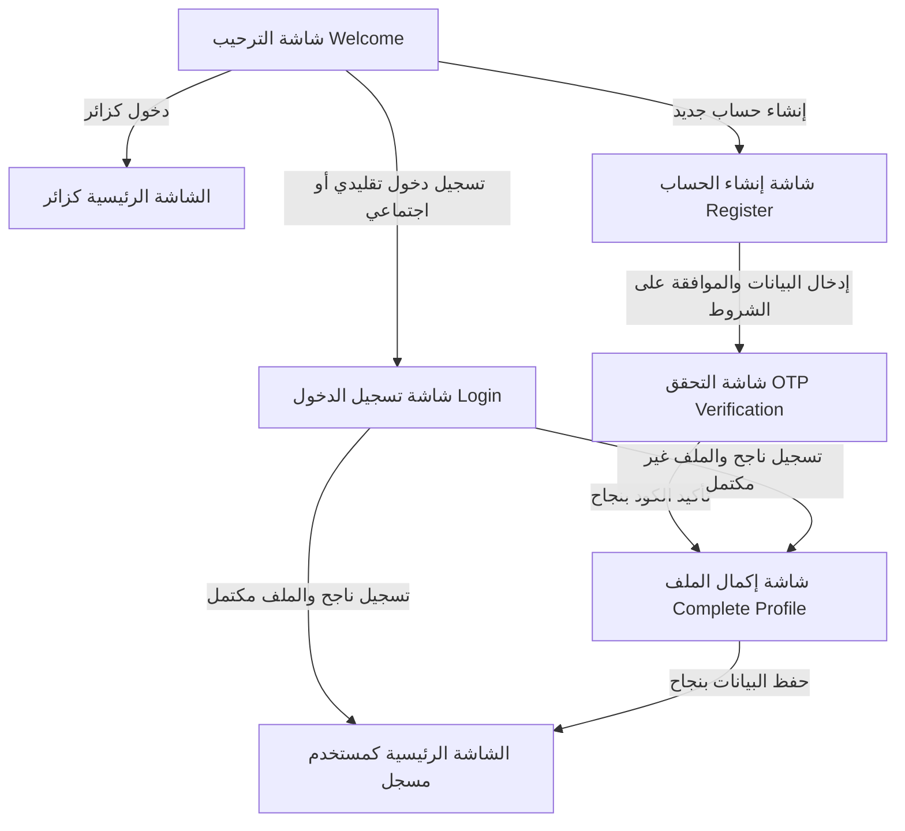

# وثيقة المواصفات الفنية للربط مع الباك إند - نظام المصادقة والمستخدمين
# Technical Backend API Specification - Authentication & Session Management

تم إعداد هذه الوثيقة لمطور الباك إند (Backend Developer) لتوضيح كافة المتطلبات البرمجية والمسارات (Endpoints) اللازمة لبناء نظام مصادقة متكامل ومتوافق مع شاشات وعمليات تطبيق **سكنى (Sakna)**.

This document serves as the formal API specification for the backend developer, detailing all required endpoints, payloads, workflows, and session requirements for the **Sakna** application.

---

## 1. بنية الجلسات وحالات المستخدم (Session & Auth Architecture)

يجب أن يدعم التطبيق وضعين رئيسيين للتصفح والاستخدام:

### أ. وضع الزائر (Guest / Anonymous Mode)
* يستطيع المستخدم تصفح الخدمات الأساسية والعقود وسجلات البحث دون الحاجة لتسجيل دخول.
* لا يتم إرسال توكن مصادقة (`Authorization Header`) في هذا الوضع، ولكن يمكن للباك إند إنشاء جلسة مجهولة مؤقتة (اختياري) أو السماح بالوصول لروابط البحث والتصنيفات بشكل عام.

### ب. وضع المستخدم المسجل (Authenticated Mode)
* يتطلب تسجيل الدخول الكامل أو عبر منصات التواصل الاجتماعي.
* تعتمد المصادقة على رموز المصادقة الثنائية **JWT (JSON Web Tokens)**:
  * **Access Token:** يُرسل في رأس الطلب (`Authorization: Bearer <token>`)، ومدة صلاحيته قصيرة (مثال: 15 دقيقة).
  * **Refresh Token:** يُحفظ بشكل آمن لتجديد الـ Access Token دون إزعاج المستخدم، وصلاحيته طويلة (مثال: 30 يومًا).

---

## 2. المسارات المطلوبة من الباك إند (Required API Endpoints)

### 1. إرسال رمز التحقق للرقم (Send SMS / WhatsApp OTP)
* **المسار (Endpoint):** `POST /api/v1/auth/otp/send`
* **الوصف:** يرسل رمز تحقق مكون من 4 أو 6 أرقام للرقم المدخل عبر رسالة نصية قصيرة (SMS) أو عبر تطبيق **الواتساب (WhatsApp)** حسب القناة المحددة من الجوال.
* **المدخلات (Request Body):**
  ```json
  {
    "phone": "1002345678",
    "country_code": "+20",
    "channel": "whatsapp" // القنوات المدعومة: "sms" أو "whatsapp" (افتراضيًا: "sms")
  }
  ```
* **المخرجات الناجحة (Success Response - 200 OK):**
  ```json
  {
    "status": "success",
    "message": "OTP sent successfully via whatsapp",
    "data": {
      "session_id": "otp_sess_9823472394",
      "channel": "whatsapp",
      "expires_in": 120 // بالثواني
    }
  }
  ```
* **حالات الفشل المتوقعة (Error Responses):**
  * `400 Bad Request`: رقم الهاتف غير صالح أو القناة المطلوبة غير مدعومة.
  * `429 Too Many Requests`: تخطي الحد الأقصى للمحاولات (Rate limiting).

---

### 2. التحقق من رمز الهاتف (Verify OTP)
* **المسار (Endpoint):** `POST /api/v1/auth/otp/verify`
* **الوصف:** يتحقق من صحة الرمز المدخل من قبل المستخدم لتفعيل الرقم (سواء أُرسل عبر الرسائل القصيرة SMS أو عبر الواتساب WhatsApp).
* **المدخلات (Request Body):**
  ```json
  {
    "session_id": "otp_sess_9823472394",
    "phone": "1002345678",
    "country_code": "+20",
    "otp_code": "123456"
  }
  ```
* **المخرجات الناجحة (Success Response - 200 OK):**
  ```json
  {
    "status": "success",
    "message": "Phone number verified successfully",
    "data": {
      "verification_token": "v_tok_89234723984"
    }
  }
  ```
* **حالات الفشل المتوقعة (Error Responses):**
  * `400 Bad Request`: الرمز منتهي الصلاحية أو غير صحيح.

---

### 3. إنشاء حساب جديد (User Registration)
* **المسار (Endpoint):** `POST /api/v1/auth/register`
* **الوصف:** تسجيل مستخدم جديد بالبيانات الكاملة بعد موافقته على الشروط والتحقق من هاتفه.
* **المدخلات (Request Body):**
  ```json
  {
    "name": "أحمد محمد علي", // الاسم ثلاثي على الأقل
    "phone": "1002345678",
    "country_code": "+20",
    "email": "ahmad@example.com",
    "password": "Password123",
    "verification_token": "v_tok_89234723984", // لضمان التحقق المسبق من الهاتف
    "agree_to_terms": true
  }
  ```
* **المخرجات الناجحة (Success Response - 201 Created):**
  ```json
  {
    "status": "success",
    "message": "User registered successfully",
    "data": {
      "user": {
        "id": "usr_90234",
        "name": "أحمد محمد علي",
        "phone": "+201002345678",
        "email": "ahmad@example.com",
        "is_profile_complete": false
      },
      "tokens": {
        "access_token": "eyJhbGciOi...",
        "refresh_token": "r_tok_89234..."
      }
    }
  }
  ```
* **حالات الفشل المتوقعة (Error Responses):**
  * `409 Conflict`: البريد الإلكتروني أو رقم الهاتف مسجل مسبقًا بالمنصة.
  * `400 Bad Request`: البيانات غير مطابقة للشروط أو لم يتم إرسال توكن التحقق.

---

### 4. تسجيل الدخول التقليدي (User Login)
* **المسار (Endpoint):** `POST /api/v1/auth/login`
* **الوصف:** التحقق من بيانات المستخدم (البريد الإلكتروني أو الهاتف مع كلمة المرور) لمنحه الجلسة.
* **المدخلات (Request Body):**
  ```json
  {
    "login_field": "ahmad@example.com", // يقبل البريد الإلكتروني أو رقم الهاتف
    "password": "Password123"
  }
  ```
* **المخرجات الناجحة (Success Response - 200 OK):**
  ```json
  {
    "status": "success",
    "message": "Login successful",
    "data": {
      "user": {
        "id": "usr_90234",
        "name": "أحمد محمد علي",
        "phone": "+201002345678",
        "email": "ahmad@example.com",
        "is_profile_complete": true
      },
      "tokens": {
        "access_token": "eyJhbGciOi...",
        "refresh_token": "r_tok_89234..."
      }
    }
  }
  ```
* **حالات الفشل المتوقعة (Error Responses):**
  * `401 Unauthorized`: بيانات الدخول غير صحيحة أو الحساب معطل.

---

### 5. الدخول الاجتماعي (Google & Facebook Login)
* **المسار (Endpoint):** `POST /api/v1/auth/social`
* **الوصف:** مصادقة المستخدم عبر حسابه بجوجل أو فيسبوك. في حال عدم وجود الحساب مسبقًا يتم تسجيله تلقائيًا كمستخدم جديد، وإلا يتم تسجيل دخوله.
* **المدخلات (Request Body):**
  ```json
  {
    "provider": "google", // أو "facebook"
    "social_token": "google_id_token_or_facebook_access_token",
    "email": "user@gmail.com", // يتم جلبها من الـ SDK بالجوال
    "name": "Ahmad Mohammad",
    "avatar_url": "https://lh3.googleusercontent.com/..." // اختياري
  }
  ```
* **المخرجات الناجحة (Success Response - 200 OK):**
  ```json
  {
    "status": "success",
    "data": {
      "user": {
        "id": "usr_90240",
        "name": "Ahmad Mohammad",
        "phone": null, // إذا كان الحساب جديداً ولم يربطه برقم جوال بعد
        "email": "user@gmail.com",
        "is_profile_complete": false // يتطلب إكمال الملف وربط الجوال
      },
      "tokens": {
        "access_token": "eyJhbGciOi...",
        "refresh_token": "r_tok_89235..."
      }
    }
  }
  ```

---

### 6. إكمال الملف الشخصي (Complete Profile)
* **المسار (Endpoint):** `POST /api/v1/auth/profile/complete`
* **المتطلب:** يتطلب إرسال الـ `Access Token` في رأس الطلب.
* **الوصف:** حفظ البيانات الإضافية التفصيلية مثل (تاريخ الميلاد، الجنس، الصورة الشخصية، وتفضيلات العروض).
* **المدخلات (Multipart/Form-Data):**
  * `gender`: `MALE` / `FEMALE`
  * `dob`: `YYYY-MM-DD` (تاريخ الميلاد)
  * `offers_enabled`: `true` / `false`
  * `avatar`: (الملف الفعلي للصورة الشخصية - اختياري)
* **المخرجات الناجحة (Success Response - 200 OK):**
  ```json
  {
    "status": "success",
    "message": "Profile completed successfully",
    "data": {
      "user": {
        "id": "usr_90234",
        "name": "أحمد محمد علي",
        "phone": "+201002345678",
        "email": "ahmad@example.com",
        "gender": "MALE",
        "dob": "1995-08-20",
        "avatar_url": "https://cdn.sakna.com/avatars/usr_90234.png",
        "offers_enabled": true,
        "is_profile_complete": true
      }
    }
  }
  ```

---

### 7. التحقق من صحة الجلسة (Check Active Session)
* **المسار (Endpoint):** `GET /api/v1/auth/session`
* **المتطلب:** يتطلب إرسال الـ `Access Token` في رأس الطلب.
* **الوصف:** يتم استدعاؤه فور تشغيل التطبيق للتحقق من صلاحية التوكن المخزن محلياً وجلب بيانات الملف الشخصي الحالية.
* **المخرجات الناجحة (Success Response - 200 OK):**
  ```json
  {
    "status": "success",
    "data": {
      "user": {
        "id": "usr_90234",
        "name": "أحمد محمد علي",
        "phone": "+201002345678",
        "email": "ahmad@example.com",
        "gender": "MALE",
        "avatar_url": "https://cdn.sakna.com/avatars/usr_90234.png",
        "is_profile_complete": true
      }
    }
  }
  ```
* **حالات الفشل المتوقعة (Error Responses):**
  * `401 Unauthorized`: التوكن منتهي أو غير صالح (يقوم الجوال بطلب مسار التجديد `refresh` أو توجيه العميل لشاشة تسجيل الدخول).

---

## 3. خوارزمية وتدفق شاشات المصادقة (Auth Navigation & State Flow)

فيما يلي تمثيل برامجي لخطوات انتقال المستخدم داخل التطبيق من البداية وحتى الوصول للشاشة الرئيسية:



---

## 4. نصائح أمنية وإعدادات للباك إند (Security & Best Practices)

1. **الحد من المحاولات (Rate Limiting):**
   * يجب تحديد عدد محاولات طلب الـ OTP للرقم الواحد بحد أقصى **3 طلبات كل 10 دقائق** لتجنب هجمات الرسائل المكلفة والسبام (ينطبق هذا القيد على قنوات الـ SMS والـ WhatsApp معًا).
2. **صلاحية الـ OTP:**
   * يجب ألا تزيد صلاحية رمز التحقق (OTP) عن **2 دقيقة (120 ثانية)**.
3. **تشفير كلمات المرور:**
   * يجب حفظ كلمات المرور مشفرة باستخدام خوارزميات حديثة وقوية مثل **BCrypt** أو **Argon2id**.
4. **حماية التوكن (JWT Security):**
   * يجب أن يحتوي الـ Access Token على معرف المستخدم وصلاحياته الأساسية فقط، ولا يحتوي أبدًا على كلمات مرور أو بيانات سرية.
5. **ربط بوابة إرسال الواتساب (WhatsApp OTP Delivery):**
   * يجب على الباك إند ربط خدمة إرسال رسائل واتس آب رسمية وموثوقة، ومن الحلول المقترحة:
     * **Meta Cloud API** (الربط الرسمي المباشر من فيسبوك)
     * **Twilio WhatsApp Business API** (أكثر بوابات الربط استقراراً للمطورين)
     * **UltraMsg** أو **4Whats** (حلول خارجية سهلة وموفرة تدعم إرسال الرسائل عبر مسح الـ QR للرقم المخصص للإرسال)
